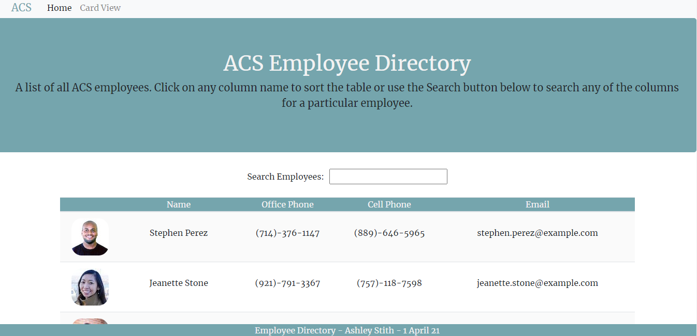

# hw19 Employee Directory, 1 APR 21

#### By Ashley Stith

## Description
This application is an employee directory created with React.  The application is broken out into UI components, the component states are managed and it responds to user events. When rendered, the application first makes an API call to the [Random User API](https://randomuser.me/).  The API retrieves 50 random users that are rendered into a table.  Users are able to sort the table by clicking on any column name.  In addition, users are able to filter the table by any column nam by using the Search Employees input.

## Features
The application utilizes React and stateful components to manage and respond to user events.  In addition, it uses an external API ([Random User API](https://randomuser.me/)) to pull in user data to test.

## Components
The application includes the following components. They are all stored in the /src/components folder
* Footer - footer of the page
* Jumbotron - top banner on the page
* Navbar - top navigation
* Results - tbody (employee data) in the table
* Table - table with functions for sorting/filtering
* Wrapper - wraps main components

## Site Images
### Homepage
The homepage displays the employee directory.  A search input field is included to allow users to filter the table. (Note: Application may have changed slightly since taking screenshot)


## Dependencies
The application includes the following dependencies:

[Bootstrap](https://getbootstrap.com/)

[Random User API](https://randomuser.me/)

The application is invoked locally by using the following command:

```bash
npm start
```

## Installation
* Install node.js to computer, if not already present.

    * Node.js can be installed from [here](https://nodejs.org/en/).

* Copy all the application files locally to one's machine.

* In a terminal window where you copied the files, install all dependencies. These installations are accomplished by performing the following command:

```bash
npm i
```

## Known Bugs
* There are no known bugs.

## Technologies Used
* Reactjs
* Bootstrap
* Random User API

## Contact
Please email [Ashley Stith](mailto:ashleyc.stith@gmail.com) with questions or for additional inforamtion.

## Contribution Guidelines
Direct link to repository: https://github.com/stithac/employee-directory

## Deployment
The site is deployed to Github pages: https://stithac.github.io/employee-directory/
